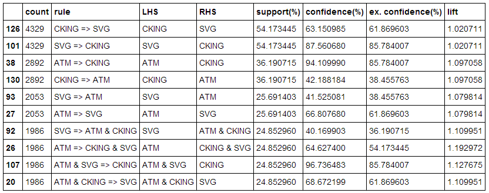
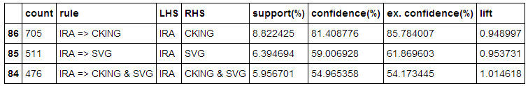

## useful-scripts
==============

#### MarketBasket/MarketBasket.py

*v. 0.1 on 04 APR 2014*

Dependencies: [NetworkX](http://networkx.github.io/) and [Pandas](http://pandas.pydata.org/).

The results of analysis on this example dataset were validated against the results in SAS Enterprise Miner.

This script/module provides a class called `MarketBasket` that performs simple market basket (association rule) analysis. The sample data file is called `bank.csv` and looks like the example below. Basically, you have a column for the transaction identifier and a column for the product purchased. The third column, `VISIT` in the example, is for sequence analysis, which is not yet implemented.

```
TRANSACTION,PRODUCT,VISIT
500026,CKING,1
500026,SVG,2
500026,ATM,3
500026,ATM,4
500075,CKING,1
500075,MMDA,2
500075,SVG,3
500075,ATM,4
500075,TRUST,5
500075,TRUST,6
500129,CKING,1
500129,SVG,2
500129,IRA,3
500129,ATM,4
500129,ATM,5
500256,CKING,1
500256,SVG,2
...
```

The basic usage is:

* Import the Library
```
import MarketBasket as mb
```
* Create an object to work with
```
mba = mb.MarketBasket()
```
* Load your data from CSV
```
mba.load_csv_data("bank.csv")
```
*You also can assign the data to the object if you already loaded it elsewhere and have it in the proper format. In that case, use `load_data()`. See the code for more info.*

* Build the association graph. The parameter here indicates the maximum number of products that can be on each side of the rule. `A & B => C`, for instance, has 2 products on the left hand side. Performance will degrade if you go above 3, most likely.
```
myGraph = mba.build_association_graph(2)
```

* Get the association association rules as a Pandas DataFrame
```
myRules = mba.associationRules()
```

* You then can work with the rules as you would with any other Pandas dataset...
```
myRules.head()
```

Output will look like:


If you want to see only the rules that have a particular LHS to them, for example, you can do something like this:
```
myRules2 = myRules[(myRules['LHS'] == 'IRA')]
myRules2.head()
```


----

#### multi_process.py

*v. 1 on 15 JAN 2014*

*NOTE: This script was derived from a [StackOverflow.com question](http://stackoverflow.com/questions/18204782/runtimeerror-on-windows-trying-python-multiprocessing). I was not the original author, [NG Algo](http://stackoverflow.com/users/1293955/ng-algo) was.*

I modified the script for a task where I needed to parse 11,000 text files, transform the records in them, and push them into a Mongo database.

For my use case, I created a list of all of the files, and split the files between multiple processes (with one thread on each process). Each process loaded the files it was given, did the processing, and then bulk pushed cleaned data into MongoDB. 

I removed my modifications and put the shell of the script here in this repository.

If you run it as is, you will see that it launches 6 separate processes and 4 threads on each process. 

The way to use it is to modify the classes and what you pass to them so that you can use all of your computer's CPU power to perform tasks in parallel. Your likely limitation is disk I/O. Therefore, after modifying the script, it's best to start testing with a low number of processes and 1 thread on each and then increment from there until you find the point of diminishing returns for your tasks.

Once you make some minor modifications and track the flow of process and thread generation, you'll understand clearly where you need to inject your data and other code.

----

#### twitter_getter.py

*v.3 on 12 FEB 2014*

- Update to show warning from Twitter when you're not keeping up with the stream. Simple buffering of tweets between writes to files, in an attempt to improve performance.

*v.2 on 11 JAN 2014*

This script connects to the free Twitter API and allows you to gather tweets through a persistent stream, through the search API, or from a specified user's profile.

You can save the tweets that you collect either as .csv files, as raw .json files, or push them directly into a local instance of [MongoDB](http://www.mongodb.com/). 

At the moment, if you elect to save .csv files, you will not get all of the metadata that comes along with each tweet -- only a subset of the most important data. This was done to save space on a large project, where the script tracked a stream for 2 months and collected ~ 15 million tweets.

The scripts is provided as-is, with no warranty, and is free to the public domain. Please feel free to take it, use it, modify it, redistribute it, etc. If you make improvements or clean it up, I'll accept pull requests.

*Requirements*

- You must have a Twitter account.
- You must register your Twitter account as a developer at [dev.twitter.com](http://dev.twitter.com).
- You must create an app at dev.twitter.com.
- You must authenticate yourself to use the app that you create.
- You must copy you app's key/secret and your Oauth key/secret and paste them in the top of the `twitter_getter.py` file.
- You must have the pymongo and beautifulsoup4 libraries installed on your computer.
- Developed and tested with python 2.7.5 (Anaconda) and Twython 3.1.2

*Known Issues*

- There are bugs with the new cursor functions in Twython 3.1.2, which is why the search API parts of this script use the "old" search syntax instead of the new cursor syntax.


